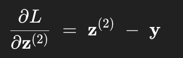
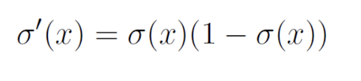
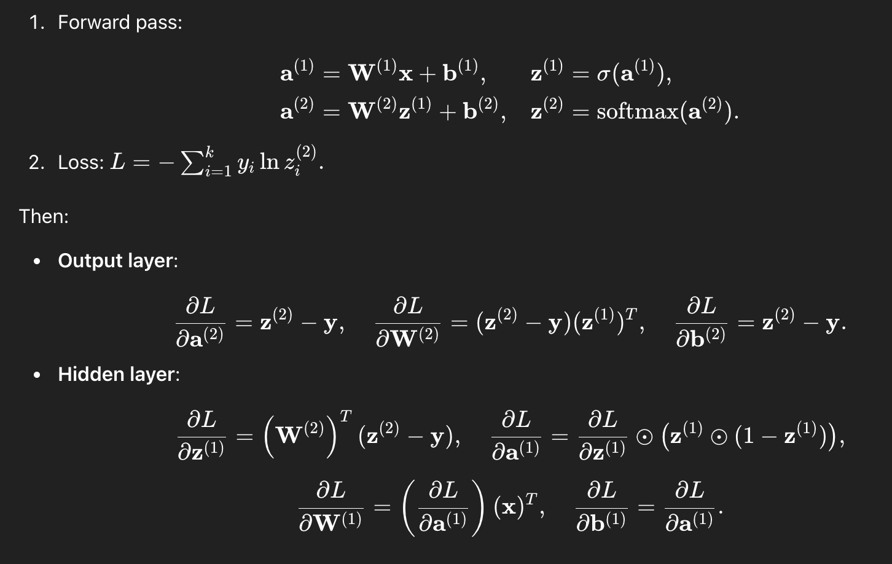

## Implemented Neural Network for classification with mini batch gradient descent using numpy 
Dataset: MNIST Handwritten digit images (0-9)  
Training images: 50,000  
Testing images: 10,000  
Image size: 28x28  

## Architecture
### 1 hidden layer
### Loss function: Cross-entropy loss
### Activation function:
- Sigmoid (Hidden layer)
- Softmax (Output layer)
## Hyperparameters
### Learning Rate: 5
### Number of hidden units: 300
### Batch size: 1000
### Epochs: 30
## Backpropagation formulae
### High Level steps
- Find derivative wrt activation layer (Z)
- Find derivative wrt pre-activation layer (A)
- Find derivative wrt Weights (W) and bias (B)
### IMPORTANT POINTS

#### This simple formula results from these facts:
- Softmax in the final layer
- Cross‐entropy as the loss function
- One‐hot labels 
#### Derivative of sigmoid

### Final formulae that I implemented
